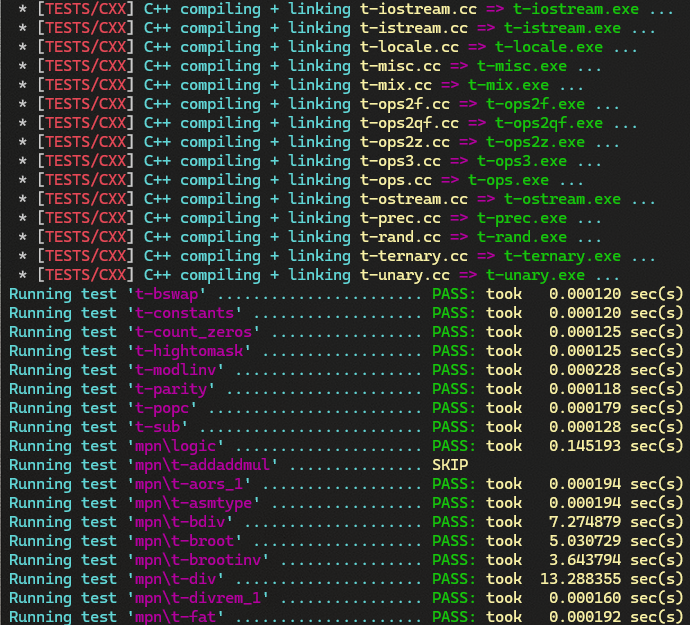

# Native Win64 build of GNU libgmp and libmpfr

Of course, you can build the two multi-precision libraries GNU libgmp and libmpfr also for MS Windows using a MingW or Cygwin environment or on the Linux subsystem for Windows.

But if you need the two libraries (or one of them) as a native Win64 build using MS Visual C/C++, then this is the project you are looking for.

It is dedicated to 64bit MS Windows on X86-64 and ARM64. The majority of the work on the original libraries went into the conversion of the x86-64 assembler code, which dramatically speeds up the computations.

The Linux 64bit X86-64 ABI (Application Binary Interface) is called '*System V AMD64 ABI*' and differs substantially from the '*MS Windows AMD64 ABI*'. Furthermore, the AT&T assembler syntax usually used on Linux systems differs from the native Intel/AMD assembler syntax that is understood by the Microsoft Assembler *ml64.exe* on MS Windows.

The ARM64 ABI is the same on Linux or MS Windows, respectively. Only some small modifications were necessary to bring these assembler source codes to MS Windows (for *arm64asm.exe*).

## What Do you need to compile the libraries on MS Windows?

You need three things:

1. MS Visual C/C++ 2026 installation, probably the Community Edition (CE);
2. Native x86-64 and/or ARM64 build environment cmd.exe (comes with MS Visual C/C++);
3. A UNIX-style '**patch**' utility, e.g. the one which comes with a 'GIT for Windows' installation.

## Build instructions in a nutshell (for the impatient)

This build was created for and tested with libgmp, version 6.3.0, and libmpfr, version 4.2.2 on MS Windows 11/64bit (X86-64 and ARM64). You can either build a static library with the test suite and the tuneup utility or the dynamic library with a static import library and the test suite (no tuneup in this case).

Please follow these steps:

1. Download the original GNU source of the library and extract it somewhere;
2. Copy the folder 'win64' from this github repo recursively into that folder (there is one win64 folder for libgmp and one for libmpfr - you have to build libgmp first before building libmpfr);
3. Lookup your patch utility (has to be declared as the makefile variable 'PATCH' - the default value assumes a GIT on MS Windows installation and is: "c:\Program Files\Git\usr\bin\patch.exe");
4. Enter the source folder and patch the source codes: `nmake /f win64/Makefile patch`;
5. Build the optimized library version using: `nmake /f win64/Makefile ASSEMBLY=` (this automatically executes the test suite and subsequently builds the tuneup.exe tool); for libmpfr, you have to define the Makefile variable 'LIBGMP_BUILDDIR=path' (the built libgmp has to be there), i.e. `nmake /f win64/Makefile LIBGMP_BUILDDIR=..\gmp-6.3.0`;
6. For ARM64 builds, add the Makefile variable '**ARM64=**' to the command line (if you are using a cross build environment, then modify the Makefile variables, see below, to exclude the test suite!);
7. Optional: execute tuneup.exe by typing `tune\tuneup.exe` (please do read the bugs section below).

Please see below for the full explanation of all build variables (also documented in the header section of the win64\Makefile).

## The signed/unsigned long problem

The MS Windows native build uses **64bit limbs** ('unsigned __int64' type). Nevertheless, there is a global problem in libgmp/libmpfr not defining a clean (own) 64bit signed/unsigned integer type. Because this project is about 64bit builds of the two libraries only, let us compare the GNU Compiler Collection (64bit) with MS Visual C/C++ (also 64bit) in brief.

All integer data types up to and including 'int' (i.e. 'char', 'short', and 'int') are identical (8bit, 16bit, and 32bit). With 'signed/unsigned long', things change between gcc and msvc: The GNU compiler collection defines 'long' (and, by the way, also 'long long') both as 64bit integers.

msvc defines 'long' as 32bit, 'long long' as 64bit (or using the Microsoft-specific '__int64' type). There are many occurrences of 'long', 'signed long', 'unsigned long', 'signed long int', 'unsigned long int', etc. in the libgmp or libmpfr source codes, respectively.

As stated above, it would had been better to declare a 'gmp_int64_t' and 'gmp_uint64_t' together with a bunch of macros for 'GMP_INT64_MIN', 'GMP_INT64_MAX', and 'GMP_UINT64_MAX', a macro for the suffix of constants (this is e.g. 'ULL' for the gcc and 'ui64' for msvc ('ULL' also works)). And, finally, a macro for the printf prefix (this is 'l' or 'll' for gcc and 'll' or 'I64' for msvc). Some of the applied patches fix e.g. the printf prefixes in the source code for the MS Visual C build.

Using the special Makefile variable 'FULL_64BIT=', you can force the libgmp to use the 64bit integer **also** for the two types 'mp_size_t' and 'mp_exp_t', which would otherwise be declared as 'long int' (thus 32bit on MS Windows). Please **DO NOTE** that this works for libgmp but **BREAKS** the libmpfr build, i.e. if you intend to use both libraries, **DO NOT** define this Makefile variable.

## All Makefile options

The Microsoft NMake Makefiles (one for libgmp, another one for libmpfr) perform a static library build (default). You can also create dynamic link libraries together with a static import library. In this case, the Makefile first produces a static library (but with dllexport directives), which is in turn converted into a DLL and a static import library. A module definition file (.def) is used to assign ordinal numbers to the exported functions. This meta static library is solely there for the final DLL creation - do not use such a static library in your projects; instead, build a clean static library for this purpose.

| Makefile variable      | Description                                                  |
| ---------------------- | ------------------------------------------------------------ |
| ASSEMBLY=              | use X86-64 or ARM64 assembly (libgmp only)                   |
| VERBOSE=               | show assembler, compiler, and linker outputs                 |
| MORE_VERBOSE=          | like VERBOSE= but also use compiler switch /W3 (show all warnings) |
| DEBUG=                 | add debugging symbols and build a non-optimized version      |
| DEBUG_IN_RELEASE=      | still build release version but include debugging symbols    |
| DYNAMIC_RT=            | use dynamic runtime (e.g. /MD) instead of static runtime (/MT, the default) |
| LINK_DLL=              | link tools (e.g. test applets) against DLL and not against static library |
| FULL_64BIT=            | (only libgmp); use 64bit integer also for mp_size_t (otherwise, this is just long=32bit in MS Visual C => **this breaks a libmpfr build!**) |
| SECURITY=              | enable additional runtime and stack checks                   |
| INTEL64=               | use '/favor:INTEL64' with msvc                               |
| AMD64=                 | use '/favor:AMD64' with msvc                                 |
| ARM64=                 | build for ARM64 aka AArch64 (otherwise, this is X86-64)      |
| ARCH=xxx               | only for X86-64: You may optimize more for a specific CPU architecture, e.g. xxx=AVX2 or xxx=AVX512 - this build most likely does not execute on other machines; please note that Windows 11 requires the 'popcount' CPU instruction or it won't boot - it is save to use at least xxx=AVX2 for all builds. |
| PATCH=xxx              | specify fully-qualified path to patch.exe utility, a UNIX-style patch tool |
| LIBGMP_BUILDDIR=<path> | (only libmpfr); specify the build folder of the libgmp (you have to build libgmp before building libmpfr) |

For DLL builds, please **DO USE** 'DYNAMIC_RT=' and 'LINK_DLL=' always together. You may also build a DLL with the static runtime but this not only disables certain test applets but also causes trouble if you try to share memory pointer or file handles between your application and the DLL.

The rule of thumb is: use either dynamic runtime or static runtime for static library builds but always use the dynamic runtime for DLL builds.

The static library is named 'libgmp.lib' (or 'libmpfr.lib'). The DLL is named 'libgmp.dll' (or 'libmpfr.dll'). The import library for the DLL is named 'libgmp-imp.lib' (or 'libmpfr-imp.lib').

For DLLs, a version resource is added, which contains the library version number and also the information how this library was built (e.g. with or without assembly).

### Examples

- clean a previous build:

  nmake /f win64/Makefile clean

- build static library, test suite (automatically executed after build step) and tuneup.exe, no assembly:

  nmake /f win64/Makefile

- build with assembler (here: x86-64):

  nmake /f win64/Makefile ASSEMBLY=

- build the dynamic library, create an import library, build and run test suite (with assembly):

  nmake /f win64/makefile ASSEMBLY= DYNAMIC_RT= LINK_DLL= dynamic_lib check

- build the static library with assembler source codes for ARM64:

  nmake /f win64/Makefile ASSEMBLY= ARM64=

- build a static library for AMD processors with AVX512 capabilities (e.g. recent Ryzen 9):

  nmake /f win64/Makefile ASSEMBLY= AMD64= ARCH=AVX512

## Known bugs and problems

First of all, all builds (static and dynamic, X86-64 and ARM64) work with and without assembler. Please always build the test suite and execute it (Makefile target 'check') before using your build in a production environment.

The tuneup.exe tool of libmpfr works on both architectures (X86-64 and ARM64). The tuneup.exe tool of libgmp **stops** for X86-64 on MS Windows with the error message:

`mpn/generic/mul_fft.c:514: GNU MP assertion failed: nprime2 < n`

The current build system (Windows, X86-64) uses the library-provided gmp-mparam.h.

## Prebuilt libraries

The toplevel folder 'prebuilt' contains two batch files, which build several library artifacts (static, dynamic, with/without debug, with/without assembly) for either X86-64 or ARM64 Windows, respectively. A bunch of prebuilt libraries are part of this github repo.

The two batch files also illustrate the usage of various Makefile variables to control the build(s).

The batch files start by patching both library source folders (they assume gmp 6.3.0 and mpfr 4.2.2, please adjust the folder names in the batch files if necessary).
